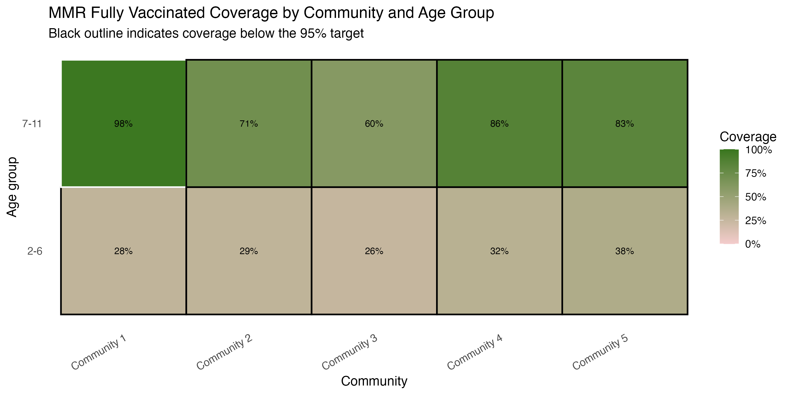

## MMR Vaccination Coverage Analysis — Seattle

Analysis of MMR vaccination coverage by community and age group as of December 31, 2024.

## Key Findings

The heatmap shows fully vaccinated coverage by community, with black outlines highlighting communities below the 95% target.

## Files

- `MMR Seattle _DhindsaShannon.R` — main analysis script
- `kpi_summary.csv` — overall coverage by age group
- `coverage_by_community.csv` — detailed coverage by community
- `mmr_coverage_heatmap.png` — visualization

## Tools

R, tidyverse, ggplot2, lubridate, janitor
